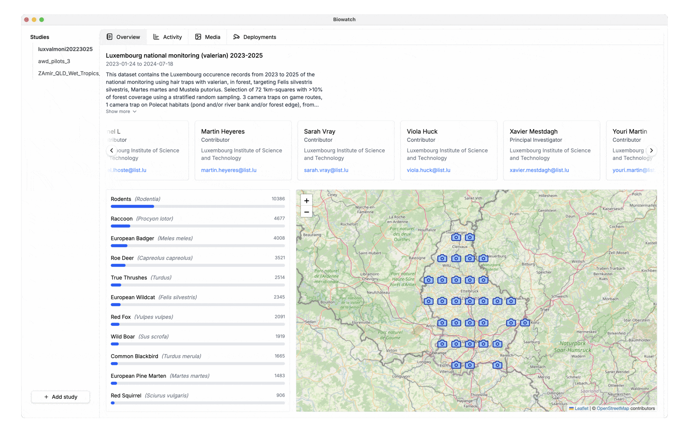

# Biowatch

<p align="center">
  
</p>


<p align="center">
    
</p>
<br/>

<p align="center">
  <a href="https://www.earthtoolsmaker.org/tools/biowatch/"> Download</a> | <a href="https://www.earthtoolsmaker.org/donate/">Support Us</a> | <a href="https://www.earthtoolsmaker.org/contact/">Contact Us</a>
</p>
<br/>
<br/>

Biowatch is a powerful tool for wildlife researchers and conservationists to
analyze, visualize, and explore camera trap data with ease.



## Key Features

- Interactive Maps: Visualize camera trap locations and wildlife sightings
with interactive maps and spatial analysis tools.
- Data Analysis: Generate insights with powerful analytics tools, species
identification, and temporal activity patterns.
- Media Management: Organize, tag, and search through thousands of camera
trap images and videos with ease.

## Documentation

Full developer documentation is available in the [docs/](./docs/) folder:

- [Architecture](./docs/architecture.md) - System design and data flow
- [Data Formats](./docs/data-formats.md) - CamTrap DP and import/export formats
- [Database Schema](./docs/database-schema.md) - SQLite tables and relationships
- [HTTP ML Servers](./docs/http-servers.md) - ML model integration
- [Development](./docs/development.md) - Setup, testing, and building
- [Contributing](./CONTRIBUTING.md) - How to contribute

## Quick Start (Development)

```bash
# Install dependencies
npm install

# Build Python environment for ML models
pipx install uv
npm run build:python-env-common

# Start development server
npm run dev
```

See [Development Guide](./docs/development.md) for full details.

## License

[CC BY-NC 4.0](./LICENSE) - Free for non-commercial use with attribution.
