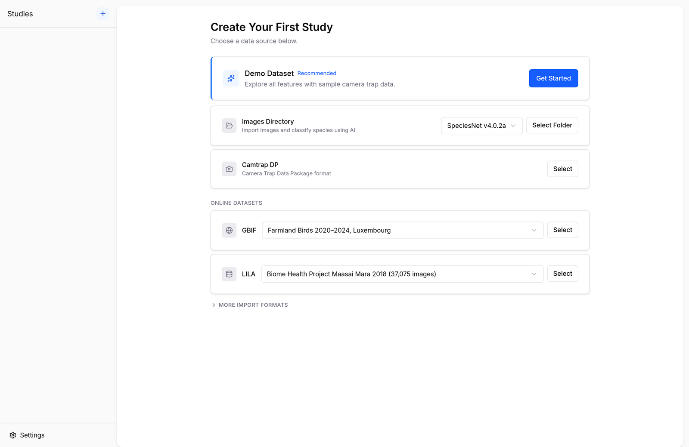
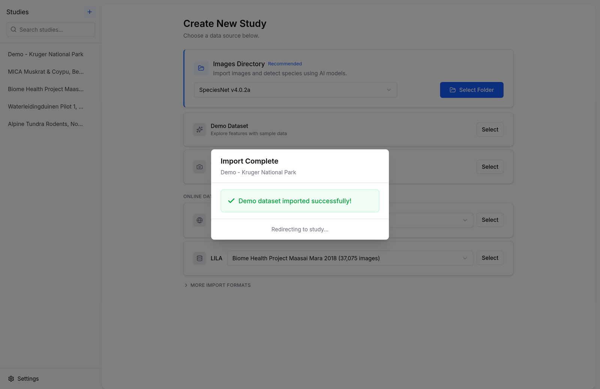

# Getting Started

Biowatch is available for Windows, macOS, and Linux. Download the latest release for your platform below.

## Download

- [Windows (.exe)](https://github.com/earthtoolsmaker/biowatch/releases/latest/download/Biowatch-setup.exe)
- [macOS (.dmg)](https://github.com/earthtoolsmaker/biowatch/releases/latest/download/Biowatch.dmg)
- [Linux (.AppImage)](https://github.com/earthtoolsmaker/biowatch/releases/latest/download/Biowatch.AppImage)

## :fontawesome-brands-windows: Windows

1. Download `Biowatch-setup.exe`
2. Run the installer
3. Follow the installation wizard
4. Launch Biowatch from the Start menu or desktop shortcut

## :fontawesome-brands-apple: macOS

1. Download `Biowatch.dmg`
2. Open the disk image
3. Drag Biowatch to the Applications folder
4. On first launch, right-click and select "Open" (required for apps from identified developers)

## :fontawesome-brands-linux: Linux

### AppImage

1. Download `Biowatch.AppImage`
2. Make it executable: `chmod +x Biowatch.AppImage`
3. Run: `./Biowatch.AppImage`

### Debian / Ubuntu

1. Download `Biowatch_<version>_amd64.deb`
2. Install: `sudo dpkg -i Biowatch_*.deb`

## Your First Study in Two Minutes

The fastest way to get a feel for Biowatch is the built-in demo dataset — a sample study based on Snapshot Kruger, with camera trap images from Kruger National Park, South Africa.

On first launch, Biowatch greets you with the **Create Your First Study** screen:

<figure markdown="span">
  { .screenshot }
  <figcaption>The import screen on first launch</figcaption>
</figure>

1. Click **Get Started** on the *Demo Dataset* card.
2. Biowatch downloads the sample data and builds the study — this takes under a minute on a typical connection.

<figure markdown="span">
  { .screenshot }
  <figcaption>The demo dataset imports in seconds</figcaption>
</figure>

When the import finishes you land on the study's **Overview** tab: a satellite map of camera locations, headline numbers (species, deployments, time span, observations, media), a strip of best captures, and the species distribution with IUCN conservation status.

From there, each tab digs deeper:

- **Overview** — the study at a glance
- **Explore** — interactive map, activity patterns, and a filterable image gallery
- **Media** — browse and filter every image and video
- **Deployments** — when and where each camera was active
- **Sources** — where the study's media comes from
- **Settings** — sequence grouping, exports, cache, and study deletion

The [Exploring Your Data](guides/exploring-data.md) guide walks through each tab in detail. When you're ready to work with your own data, head to [Importing Data](guides/importing-data.md).
