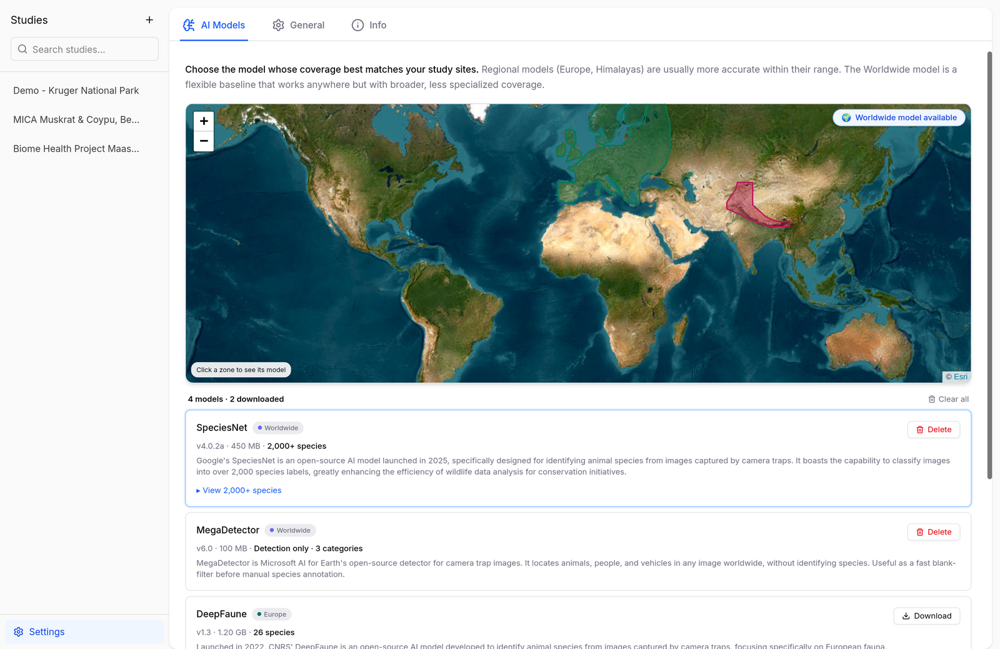
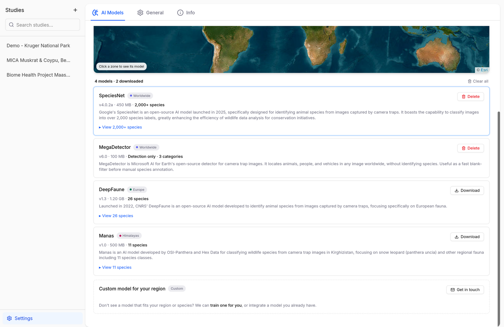

# Identifying Species with AI

Biowatch runs species identification models **locally** — images are analyzed on your machine and never uploaded anywhere.

## Installing Models

Open **Settings** (bottom of the studies sidebar) → **AI Models**. The coverage map shows which model fits your study region; the cards below it let you download and manage each model.

<figure markdown="span">
  { .screenshot }
  <figcaption>The AI Models settings page with the coverage map</figcaption>
</figure>

Click **Download** on a model card to install it (sizes range from ~120 MB to ~1.2 GB — see the table below). Once downloaded, the model appears in the model dropdown of the [Images Directory import](importing-data.md#images-directory), and **Delete** reclaims the disk space whenever you no longer need it.

<figure markdown="span">
  { .screenshot }
  <figcaption>All available models with their coverage, size, and species count</figcaption>
</figure>

## Available Models

| Model | Provider | Coverage | Species | Download size |
| --- | --- | --- | --- | --- |
| **SpeciesNet** | Google | Worldwide | 2,000+ | ~470 MB |
| **MegaDetector** | Microsoft AI for Earth | Worldwide | Detection only (animal / person / vehicle) | ~120 MB |
| **DeepFaune** | CNRS | Europe | 26 | ~1.2 GB |
| **Manas** | OSI-Panthera & Hex Data | Himalayas (Kyrgyzstan) | 11, incl. snow leopard | ~500 MB |

Which one to pick?

- **SpeciesNet** is the safe default: launched by Google in 2025, it classifies over 2,000 species labels worldwide.
- **MegaDetector** doesn't identify species — it finds animals, people, and vehicles. Use it as a fast blank-filter before manual annotation, anywhere in the world.
- **DeepFaune** is the best choice for European fauna, developed by CNRS specifically for European camera traps.
- **Manas** specializes in Central Asian mountain fauna, with a focus on snow leopards.

Regional models are usually more accurate within their range; the worldwide models are a flexible baseline.

!!! tip "Need a model for your region?"
    The team can train custom models for specific regions or integrate a model you already have — use **Get in touch** at the bottom of the AI Models page.

## Running a Model

Models run when you [import an images directory](importing-data.md#images-directory): pick the model, select the folder, and Biowatch detects and identifies the animals as it builds the study. Predictions land as regular observations — review and correct them in the [gallery viewer](annotating-images.md).
