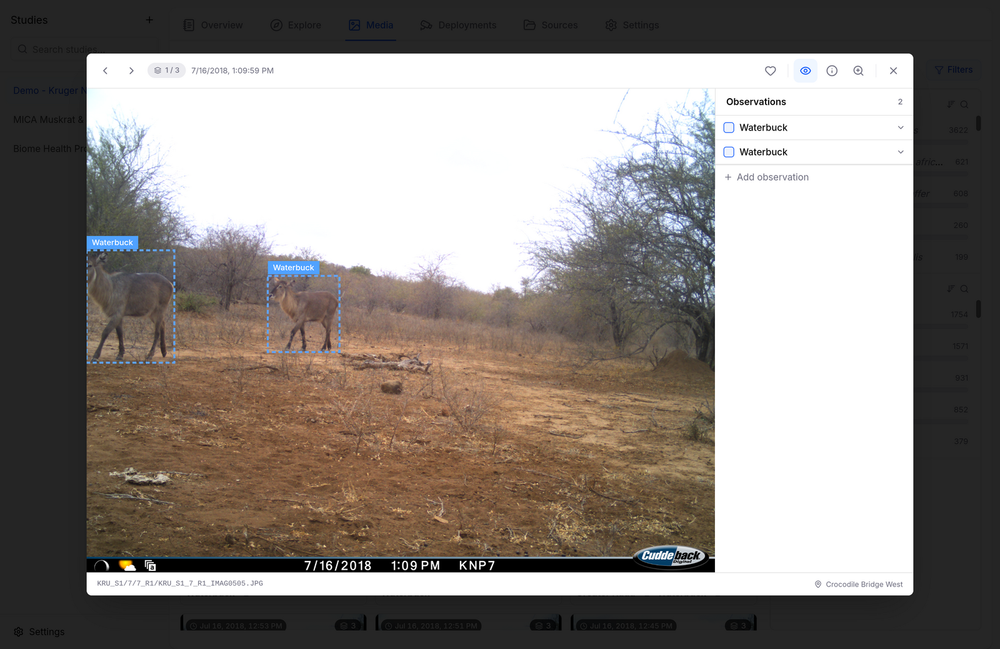

# Annotating Images

Camera trap AI is good, but not perfect — Biowatch's gallery viewer doubles as an annotation tool, so you can review, correct, and extend the observations behind every image.

Open any image from the **Media** or **Explore** tab to enter the viewer:

<figure markdown="span">
  { .screenshot }
  <figcaption>The gallery viewer: bounding boxes on the image, observations panel on the right</figcaption>
</figure>

## The Observations Panel

The panel on the right lists every observation on the current image. For each one you can:

- **Change the species** — click the species name and pick from the searchable species list.
- **Add details** — expand an observation to set sex, life stage, behavior, and count.
- **Delete it** — remove false detections.
- **Add observation** — record an animal the AI missed.

## Bounding Boxes

Bounding boxes are drawn directly on the image and stay in sync with the observations panel:

- **Move or resize** a box by dragging it or its corners.
- **Draw a new box** by dragging on the image — Biowatch creates the matching observation.
- **Toggle visibility** with the bounding-box button in the toolbar (or press ++b++).

## Keyboard-First Review

Reviewing thousands of images is a keyboard job. Press the shortcuts button (or ++question++) to see the full map:

<figure markdown="span">
  { .screenshot }
  <figcaption>Keyboard shortcuts for fast annotation</figcaption>
</figure>

| Key | Action |
| --- | --- |
| ++tab++ / ++shift+tab++ | Next / previous observation |
| ++arrow-left++ / ++arrow-right++ | Navigate images |
| ++ctrl+arrow-left++ / ++ctrl+arrow-right++ | Navigate sequences |
| ++b++ | Toggle bounding boxes |
| ++plus++ / ++minus++ | Zoom in / out |
| ++0++ | Reset zoom |
| ++del++ | Delete observation |
| ++esc++ | Close the viewer |

Every edit is undoable with ++ctrl+z++ (++cmd+z++ on macOS). Mark standout images with the heart button to find them again later.

Your corrections are stored in the study database and flow into every chart, map, and export — fix a species in the gallery and the Overview distribution updates immediately.
