# Exploring Your Data

Every study in Biowatch opens with the same six tabs. This guide walks through each one, using studies imported from the demo dataset, GBIF, and LILA.

## Overview

The Overview tab is the study's front page: title, description, and contributors at the top, a satellite map of camera trap locations, a band of key metrics (species, deployments, time span, observations, media), the best captures from the study, and the full species distribution with IUCN conservation status badges.

<figure markdown="span">
  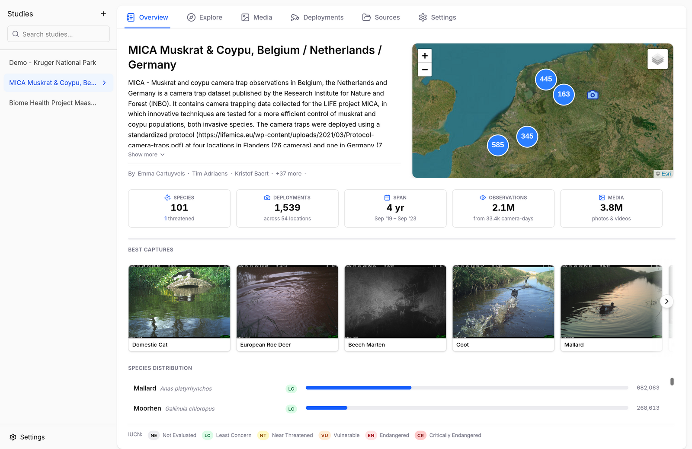{ .screenshot }
  <figcaption>Overview of a GBIF-imported study spanning Belgium, the Netherlands, and Germany — 101 species, 2.1M observations across 4 years</figcaption>
</figure>

Studies imported from LILA highlight their featured species with representative photos:

<figure markdown="span">
  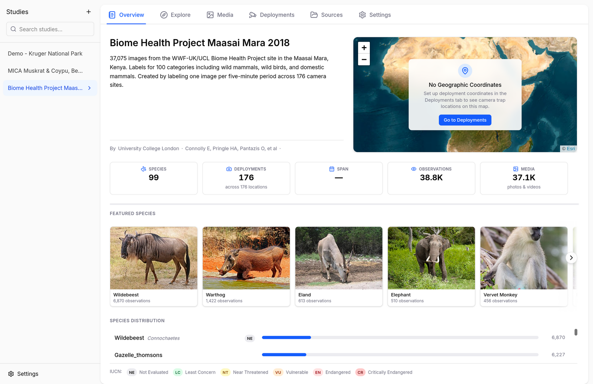{ .screenshot }
  <figcaption>The Biome Health Project Maasai Mara study from LILA</figcaption>
</figure>

Hover over a best capture (or any species name across the app) to get the species hovercard — photo, description, and a link to the IUCN Red List assessment:

<figure markdown="span">
  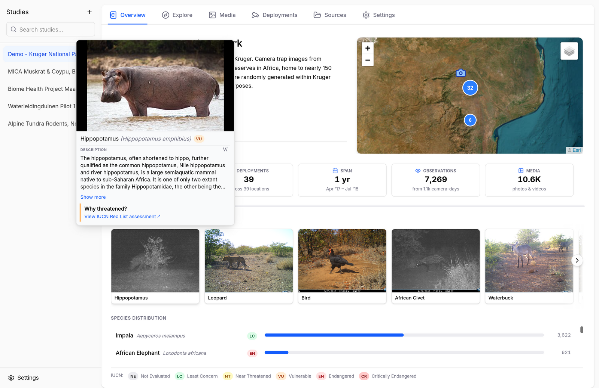{ .screenshot }
  <figcaption>The species hovercard for hippopotamus, opened from a best capture</figcaption>
</figure>

## Explore

The Explore tab is where the analysis happens. It combines three views you can toggle between — **Map**, **Gallery**, or **Both** — plus a species rail on the right.

<figure markdown="span">
  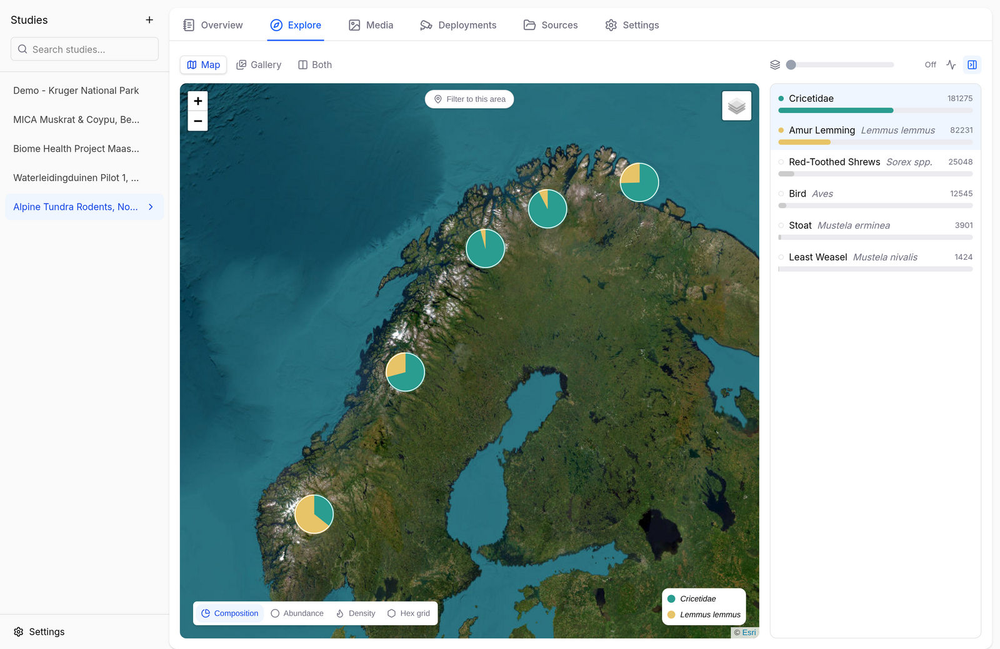{ .screenshot }
  <figcaption>Map view: each camera location is a pie chart of the selected species' share of sightings (Alpine Tundra Rodents, Norway)</figcaption>
</figure>

- **Species rail** — every species in the study with its observation count. Click species to select them; each gets a color used consistently across the map and charts. The slider at the top controls [sequence grouping](#sequence-grouping), so bursts of photos count as single events.
- **Map** — camera locations rendered as pie charts (species composition), or switch the encoding to abundance, density, or a hex grid. Click **Filter to this area** to restrict everything to the current map view.
- **Gallery** — the images behind the current selection, newest first.
- **Activity charts** — toggle the chart row (activity icon, top right) to add a daily-activity clock and a seasonal timeline. Charts can be normalized per species to compare activity patterns between abundant and rare species.

### Map Encodings

Besides species composition, the map offers an **abundance** encoding (marker size scales with the number of observations) and a **density** heatmap (where the selected species concentrate):

<figure markdown="span">
  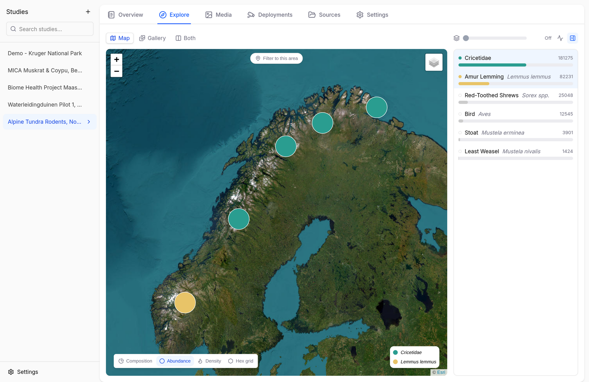{ .screenshot }
  <figcaption>Abundance: marker area scales with observation counts per camera</figcaption>
</figure>

<figure markdown="span">
  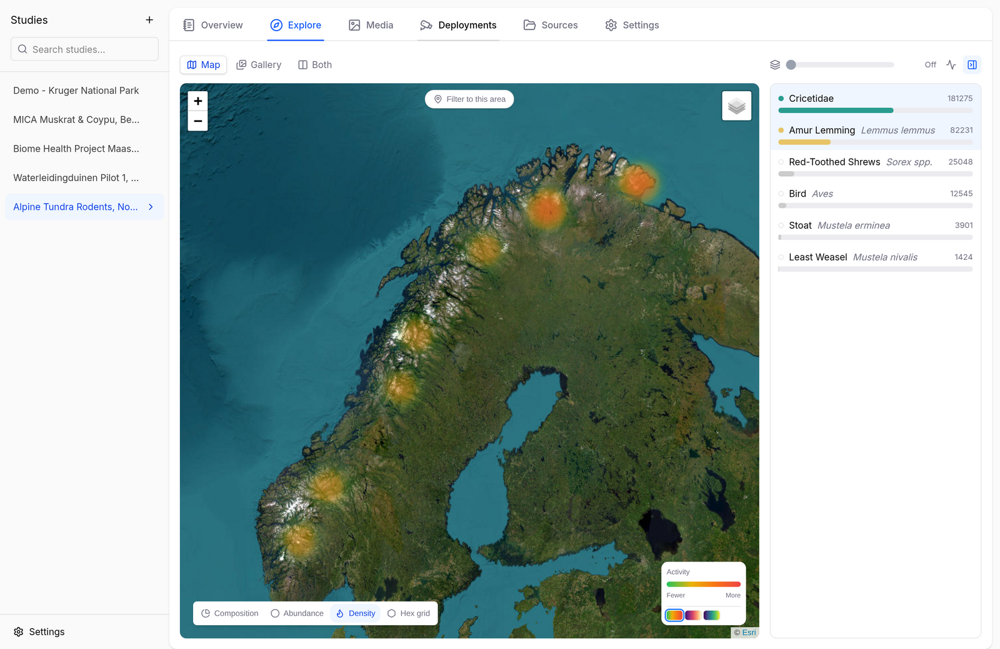{ .screenshot }
  <figcaption>Density: a heatmap of where the selected species were sighted</figcaption>
</figure>

### Hovercards

Hover over a species in the rail to get a rich species card: a representative photo from the study, daily activity clock, seasonal timeline, and a short description with a link to the IUCN Red List assessment.

<figure markdown="span">
  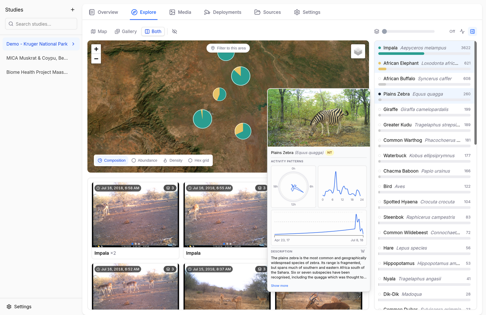{ .screenshot }
  <figcaption>The species hovercard for plains zebra</figcaption>
</figure>

Hover over a map marker to see the composition behind it — total observations at that camera and the share per selected species.

<figure markdown="span">
  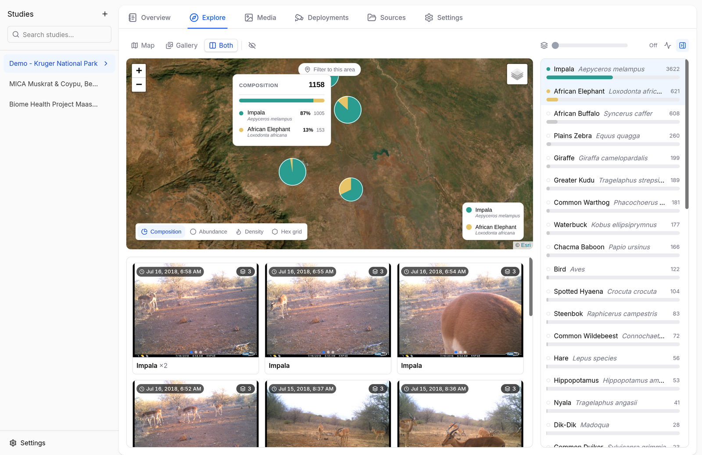{ .screenshot }
  <figcaption>The composition hovercard for a camera trap location</figcaption>
</figure>

## Media

The Media tab lists every image and video in the study, as a sortable **Table** or a thumbnail **Grid**. The rail on the right filters by species, deployment, and media type; the **Detections** dropdown filters by what the AI or annotators found; **Filters** opens date and time-of-day controls.

<figure markdown="span">
  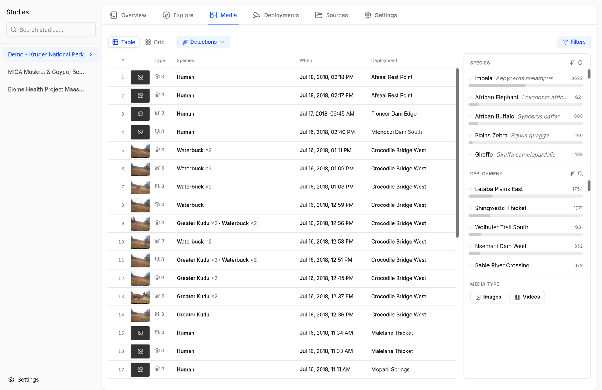{ .screenshot }
  <figcaption>Table view with species and deployment filters</figcaption>
</figure>

<figure markdown="span">
  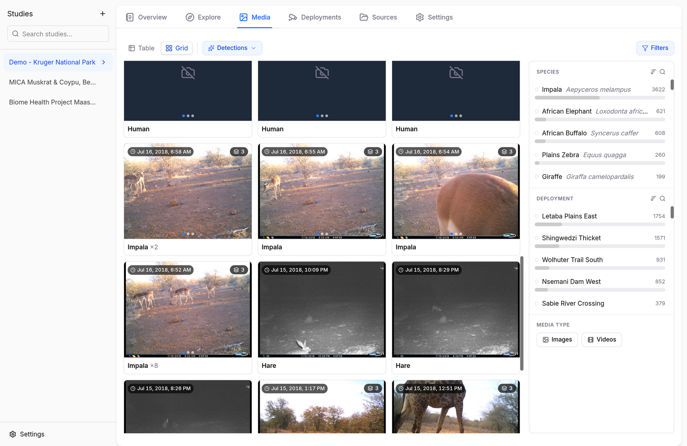{ .screenshot }
  <figcaption>Grid view filtered to a single species. Images of humans are redacted by default.</figcaption>
</figure>

The rail has hovercards too: hover a deployment to see where the camera sits and what it captured — detections, media counts, and its activity over the survey:

<figure markdown="span">
  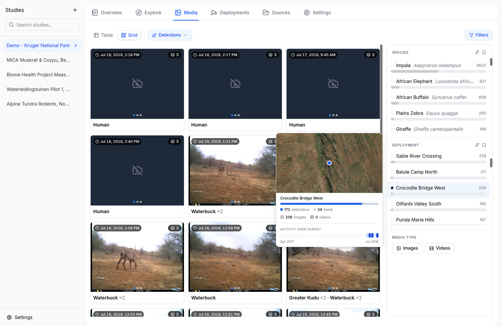{ .screenshot }
  <figcaption>The deployment hovercard in the media filter rail</figcaption>
</figure>

Click any media item to open the full-screen viewer — see [Annotating Images](annotating-images.md).

## Deployments

The Deployments tab shows when each camera was active: one timeline row per deployment, next to a map of the deployment locations. Deployment metadata can be exported and re-imported as CSV — useful for fixing coordinates or names in bulk.

<figure markdown="span">
  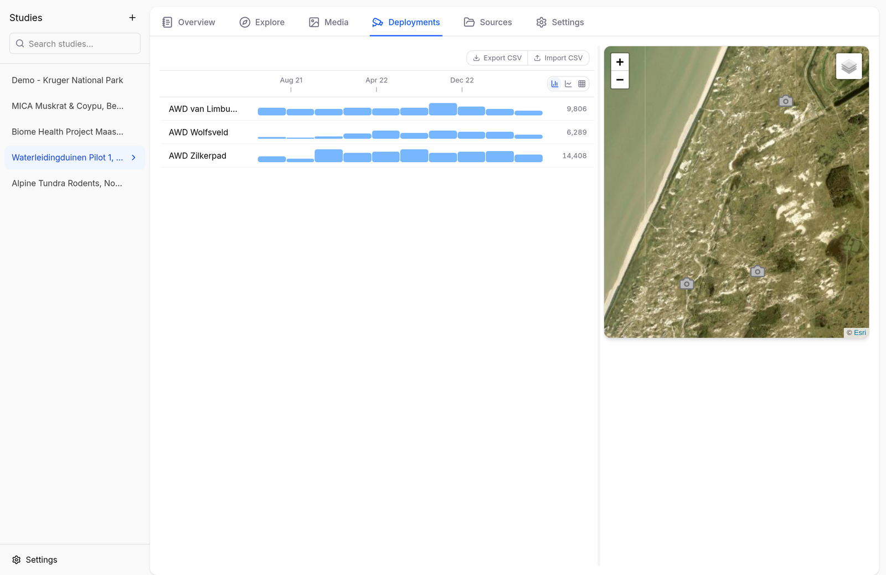{ .screenshot }
  <figcaption>Deployment timelines for a dune-monitoring pilot in the Netherlands</figcaption>
</figure>

The toggle above the timelines switches how activity is drawn — **bars** (taller = more captures), a smooth **line**, or a **heatmap** (darker = more captures):

<figure markdown="span">
  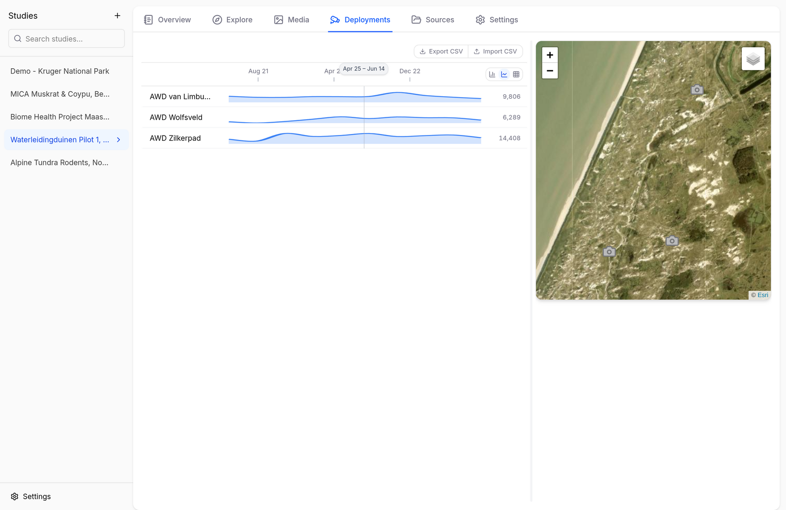{ .screenshot }
  <figcaption>Line representation — good for spotting trends</figcaption>
</figure>

<figure markdown="span">
  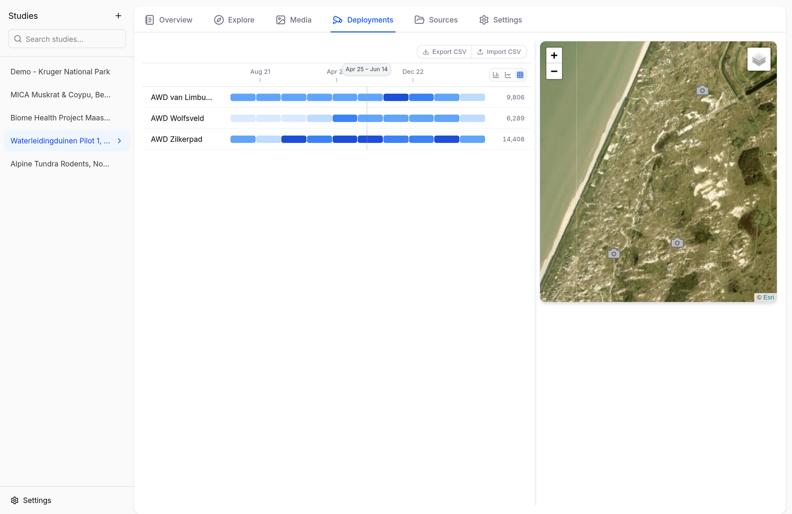{ .screenshot }
  <figcaption>Heatmap representation — darker cells mean more captures</figcaption>
</figure>

Click a deployment's timeline to open its detail pane: the camera's media gallery, its highlighted position on the map, and a direct link into the Media tab. Drag on the timeline to restrict the gallery to a date range.

<figure markdown="span">
  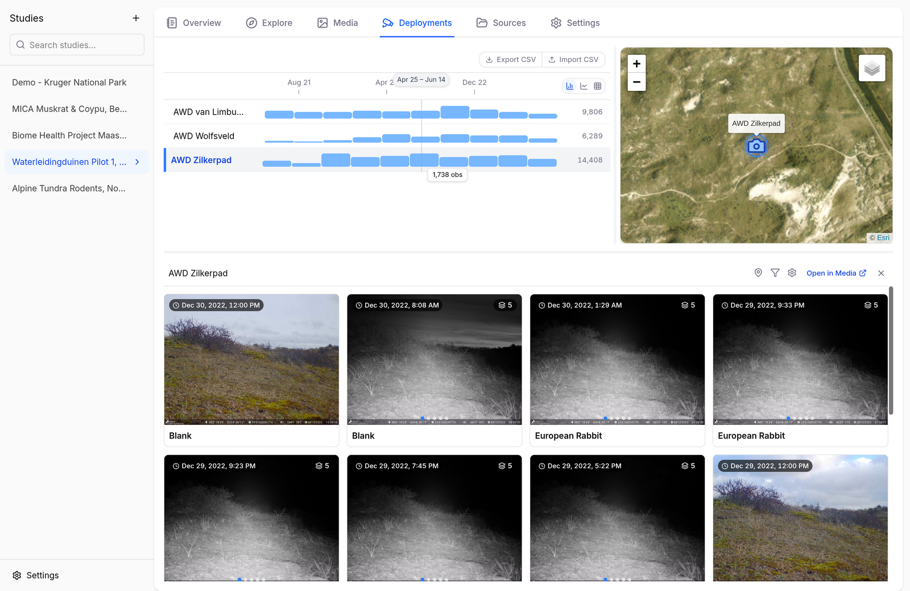{ .screenshot }
  <figcaption>The detail pane for a single deployment</figcaption>
</figure>

## Sources

The Sources tab lists where the study's media files come from — local folders, remote servers, or other studies merged in — and how many files each source contributes. Use **+ Add source** to scan an additional images folder or merge another study (see [Importing Data](importing-data.md#merging-studies)).

## Sequence Grouping

Camera traps fire in bursts: one animal walking past can produce dozens of near-identical photos. Counting each photo as an observation would wildly inflate the numbers, so Biowatch can group media into **sequences**.

You choose a *time gap* (in study Settings, or with the slider at the top of the Explore species rail). Captures from the same camera that are closer together than the gap belong to the same sequence, and each sequence counts as a single event in the charts and statistics. Within a sequence, the species count is the largest number of individuals seen together in any one frame — so an impala photographed 20 times in a burst counts once, but a frame showing three impala counts as three.

Studies imported from Camtrap DP may already carry event groupings (`eventID`); these are preserved and used when sequence grouping is off.

## Settings

The study Settings tab covers:

- **Sequence Grouping** — the default time gap used to group this study's media into sequences (see [above](#sequence-grouping)).
- **Export** — media directories or a Camtrap DP package (see [Exporting & Sharing](exporting-data.md)).
- **Cache** — transcoded videos, thumbnails, and remote images cached on disk; clear any time, they regenerate on demand.
- **Danger Zone** — delete the study from Biowatch. Your original images and videos on disk are never touched.
