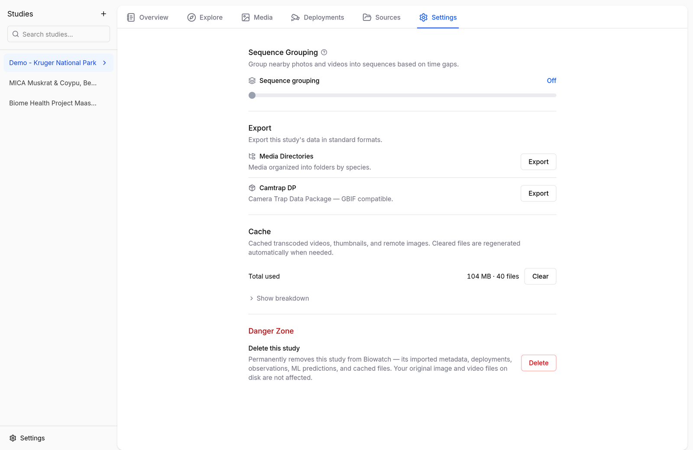
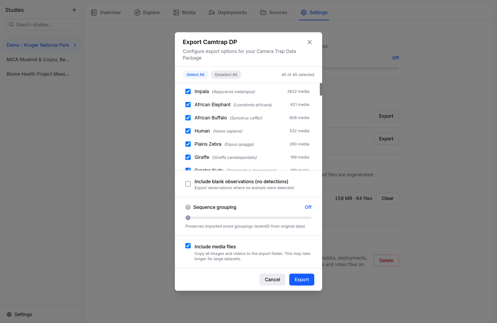

# Exporting & Sharing

Everything you import, annotate, and correct in Biowatch can leave it again in standard formats. Exports live in each study's **Settings** tab.

<figure markdown="span">
  { .screenshot }
  <figcaption>The study Settings tab with both export options</figcaption>
</figure>

## Camtrap DP

Exports the study as a [Camera Trap Data Package](https://camtrap-dp.tdwg.org/) — `datapackage.json`, `deployments.csv`, `media.csv`, and `observations.csv`, optionally with the media files themselves. This is the format to use for publishing to GBIF or moving data between camera trap platforms.

The export dialog gives you control over what goes in the package:

<figure markdown="span">
  { .screenshot }
  <figcaption>The Camtrap DP export dialog</figcaption>
</figure>

- **Species selection** — include all species or only the ones you pick.
- **Blank observations** — optionally include media where nothing was detected.
- **Sequence grouping** — preserve imported event groupings (`eventID`), or group by time gap.
- **Include media files** — copy images and videos into the package, or export metadata only.

## Media Directories

Exports your media organized into folders by species — handy for training datasets, sharing highlights, or any workflow that expects one folder per class:

```
export/
├── Impala/
├── African Elephant/
├── Plains Zebra/
└── ...
```

## Deployments CSV

From the **Deployments** tab, **Export CSV** writes the deployment metadata (IDs, names, coordinates, start/end). Edit it in a spreadsheet and re-import it with **Import CSV** to fix locations or names in bulk.
