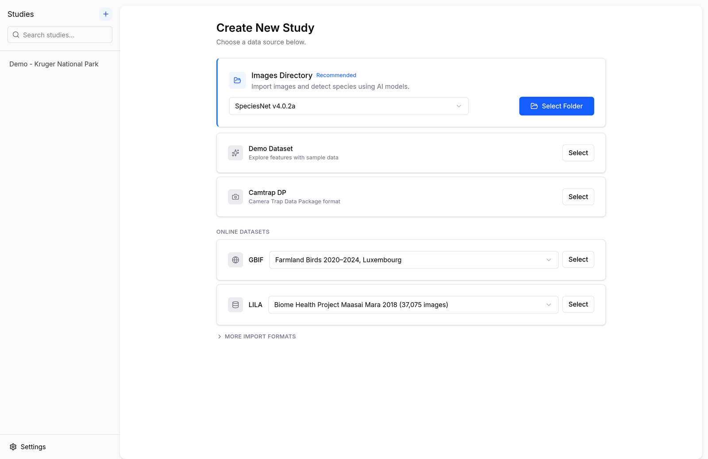
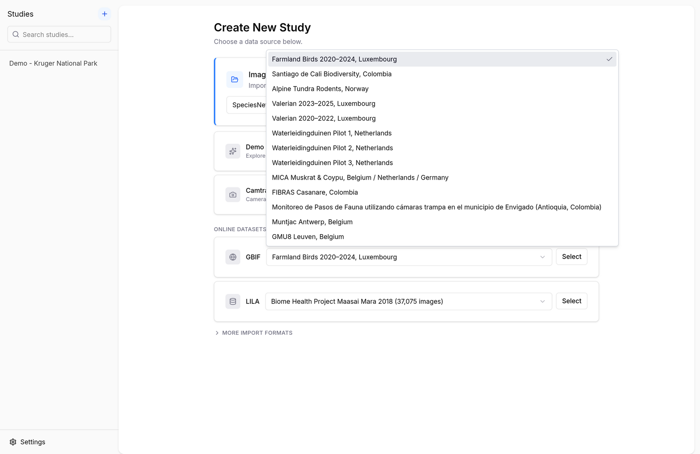
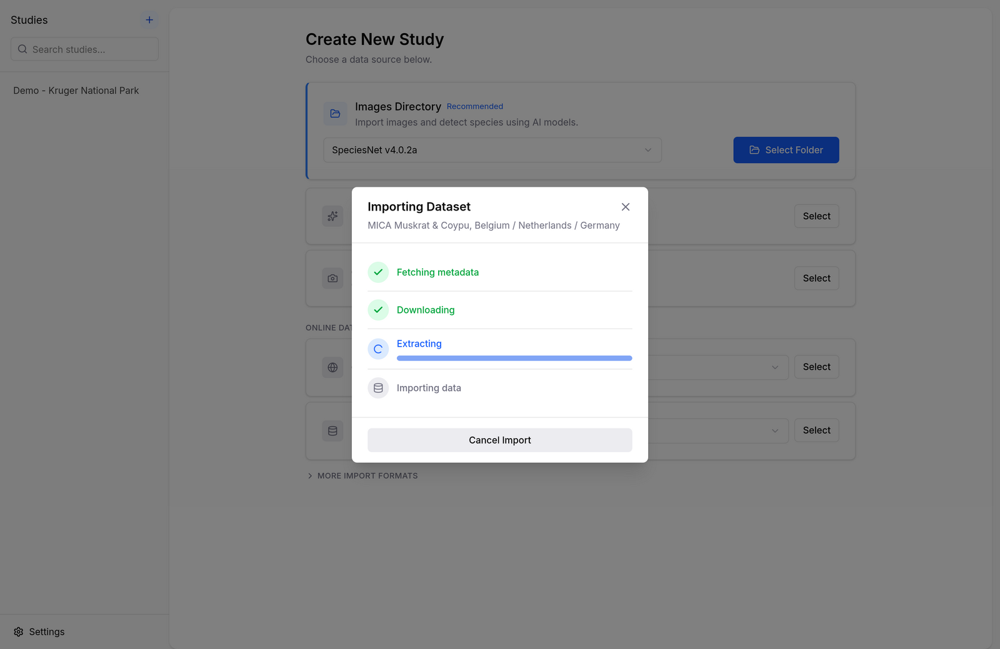
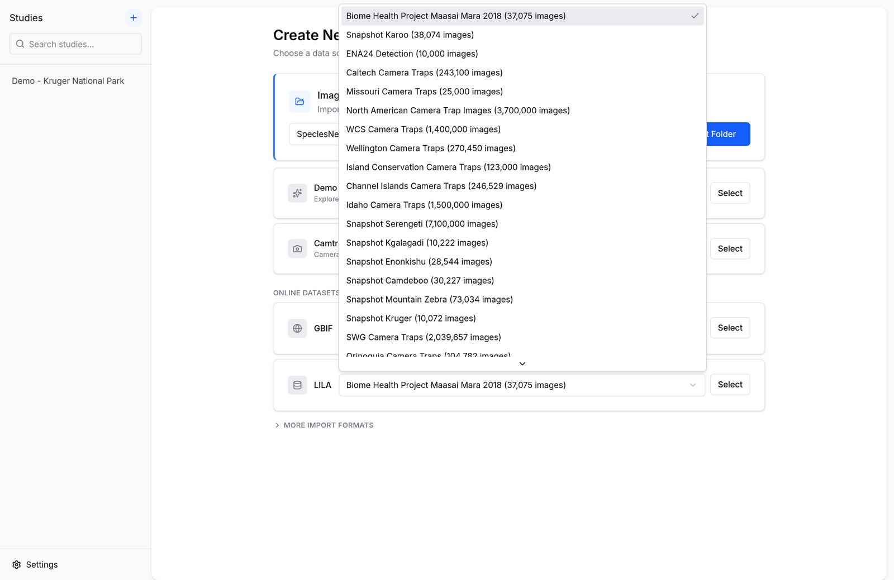
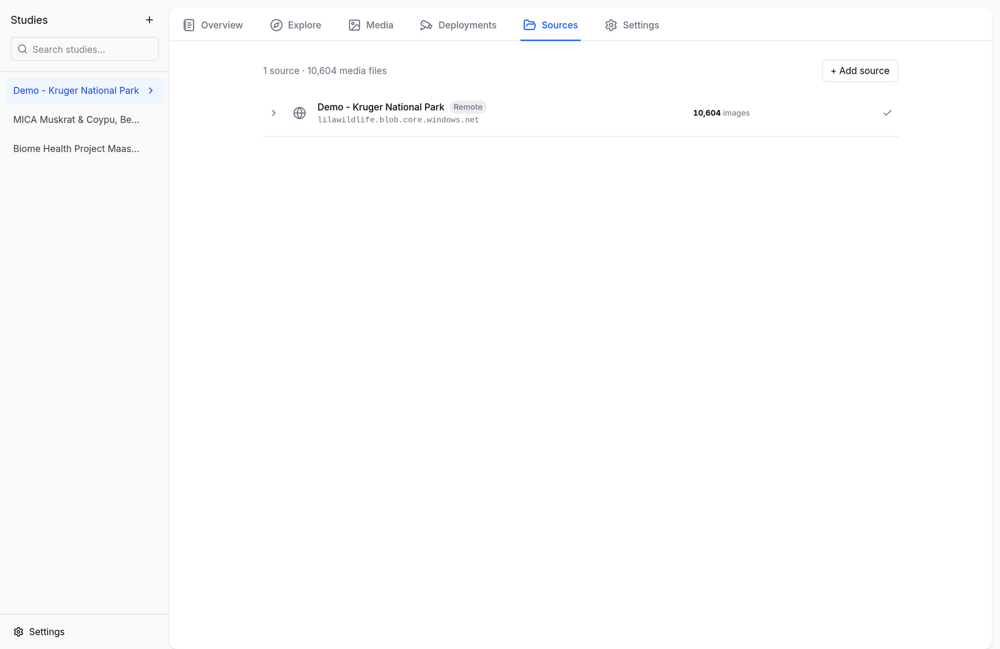

# Importing Data

Biowatch can create a study from your own camera trap data or from public datasets fetched straight from the internet. Click the **+** button at the top of the studies sidebar (or launch the app for the first time) to open the import screen:

<figure markdown="span">
  { .screenshot }
  <figcaption>The Create New Study screen with all data sources</figcaption>
</figure>

## Demo Dataset

A one-click sample study based on Snapshot Kruger (Kruger National Park, South Africa) — ideal for trying out every feature before importing your own data. See [Getting Started](../getting-started.md#your-first-study-in-two-minutes).

## Images Directory

Have a folder of raw camera trap images? Biowatch scans it, reads the EXIF timestamps, and runs a local AI model to detect and identify the animals — entirely on your machine.

1. Pick a model in the dropdown (SpeciesNet is the default; see [Identifying Species with AI](ai-models.md) for the alternatives).
2. Click **Select Folder** and choose your image directory.
3. Review the deployments Biowatch proposes, then start the scan.

The model needs to be downloaded once before first use — Biowatch will prompt you if it isn't yet installed.

## Camtrap DP

Import a [Camera Trap Data Package](https://camtrap-dp.tdwg.org/) — the TDWG standard used by Agouti, GBIF, and a growing list of platforms. Click **Select** and point Biowatch at the folder (or zip) containing `datapackage.json`.

## GBIF

Biowatch ships with a curated catalog of camera trap datasets published on [GBIF](https://www.gbif.org/). Pick one from the dropdown and click **Select** — Biowatch downloads the Camera Trap Data Package, extracts it, and builds the study automatically.

<figure markdown="span">
  { .screenshot }
  <figcaption>The curated GBIF dataset catalog</figcaption>
</figure>

<figure markdown="span">
  { .screenshot }
  <figcaption>Importing a GBIF dataset: fetch, download, extract, import</figcaption>
</figure>

## LILA

[LILA BC](https://lila.science/) (Labeled Information Library of Alexandria: Biology and Conservation) hosts some of the largest public camera trap datasets in the world — from Snapshot Serengeti to Wellington Camera Traps. Pick a dataset from the dropdown and Biowatch imports its labels and metadata; images stay on LILA's servers and are streamed in as you browse.

<figure markdown="span">
  { .screenshot }
  <figcaption>The LILA dataset catalog, with dataset sizes</figcaption>
</figure>

## More Import Formats

Under **More import formats** you'll find:

- **Wildlife Insights** — import a project export (zip) from [Wildlife Insights](https://www.wildlifeinsights.org/).
- **Deepfaune CSV** — import the CSV results produced by the [DeepFaune desktop application](https://www.deepfaune.cnrs.fr/en/).

## Merging Studies

An existing study can also absorb data from another study. Open the study's **Sources** tab, click **+ Add source**, and choose **Another study** to merge data from a study already in Biowatch, or **Images directory** to scan an additional folder with an AI model.

<figure markdown="span">
  { .screenshot }
  <figcaption>The Sources tab lists where a study's media comes from</figcaption>
</figure>

For the technical details of each format, see the [Supported Formats](../reference/supported-formats.md) reference.
