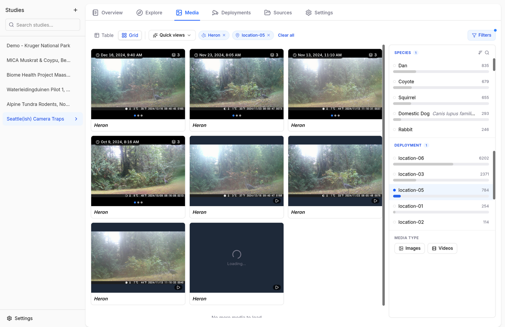
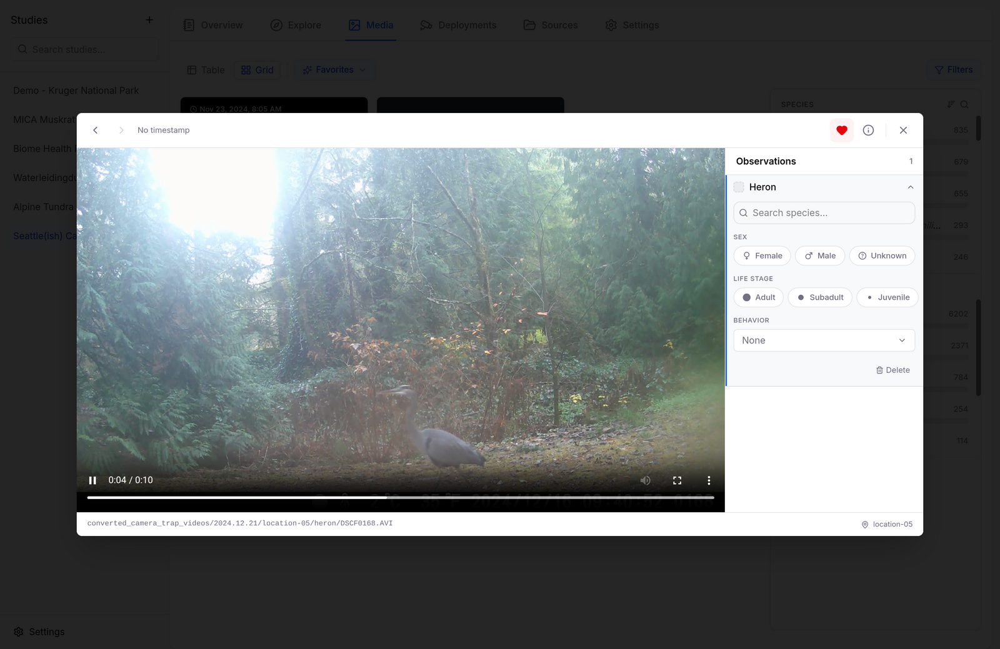

# Working with Videos

Camera traps increasingly record clips instead of (or alongside) stills, and Biowatch treats videos as first-class media: they're imported, filtered, annotated, and exported just like images. The examples below use the *Seattle(ish) Camera Traps* dataset from the [LILA catalog](importing-data.md#lila), which mixes ~20,000 images with ~4,500 videos from a single backyard in Seattle.

## Finding Videos

In the **Media** tab, the *Media type* section of the filter rail has **Images** and **Videos** chips. Combine them with any other filter — here, videos of herons only:

<figure markdown="span">
  { .screenshot }
  <figcaption>Grid view filtered to videos of herons. Video tiles show a duration and play badge.</figcaption>
</figure>

## Playing and Annotating

Click a video to open it in the gallery viewer with a full player — play/pause, seek, volume, and fullscreen:

<figure markdown="span">
  { .screenshot }
  <figcaption>A heron clip in the gallery viewer. The observations panel works exactly as it does for images.</figcaption>
</figure>

The observations panel on the right works the same as for images — change the species, set sex, life stage, and behavior, or delete a false detection (see [Annotating Images](annotating-images.md)). Bounding boxes are not drawn on videos.

!!! note "Transcoding"
    Camera traps often record in formats browsers can't play (AVI, MJPEG). Biowatch transcodes these on demand and caches the result — the first playback of a clip can take a few seconds, and the converted copy lands in the study's cache (study Settings → Cache).

## Videos in Sequences and Exports

- With [sequence grouping](exploring-data.md#sequence-grouping) on, videos join sequences alongside stills from the same camera and time window.
- CamtrapDP exports include videos in `media.csv` (and the files themselves with *Include media files* checked); media-directory exports copy them into the species folders like any other capture.
