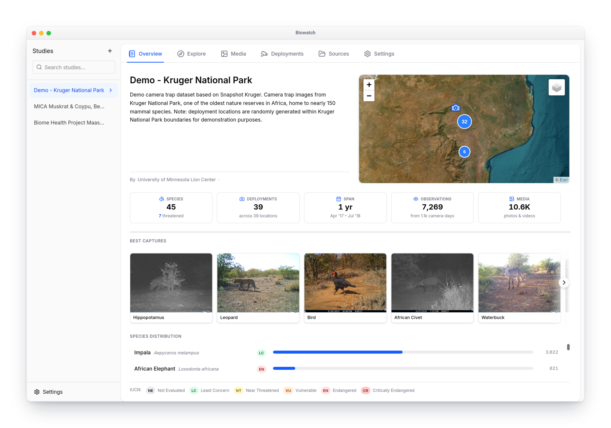
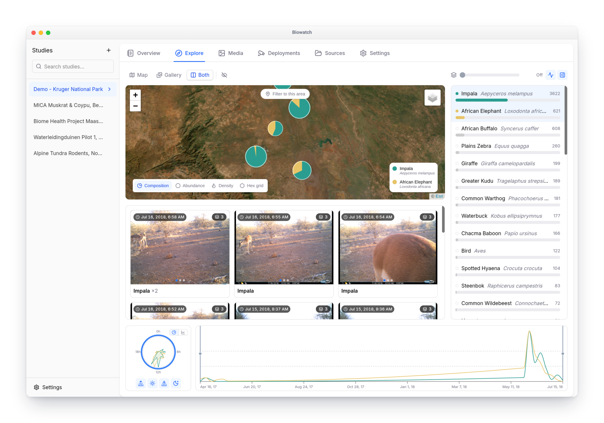
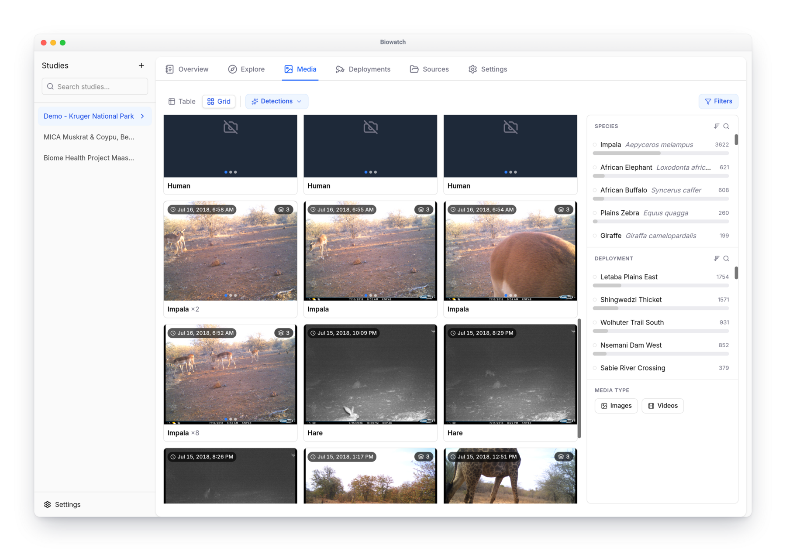

# Biowatch

  

**Analyze Camera Trap Data — Privately, On Your Machine**

Biowatch is a free, open-source desktop application for wildlife researchers and conservationists. Analyze camera trap datasets completely offline — your data never leaves your machine.

## Key Features

- **100% Offline & Private** — Your research data stays on your machine. No cloud uploads, no accounts, no tracking.
- **On-Device AI** — Species identification models run locally — no internet required.
- **Interactive Maps** — Visualize camera trap locations and wildlife sightings with spatial analysis tools.
- **Data Analysis** — Generate insights with temporal activity patterns, species distributions, and deployment metrics.
- **Media Management** — Browse, filter, annotate, and search through thousands of camera trap images and videos.
- **CamtrapDP Compatible** — Import and export using Camera Trap Data Package standards for GBIF integration.

## Screenshots

<figure markdown="span">
  { .hero }
  <figcaption>Study overview: camera trap locations, key metrics, best captures, and species distribution</figcaption>
</figure>

<figure markdown="span">
  { .hero }
  <figcaption>Explore tab: spatial composition of species sightings, daily activity clock, and seasonal timeline</figcaption>
</figure>

<figure markdown="span">
  { .hero }
  <figcaption>Browse, filter, and annotate camera trap images and videos</figcaption>
</figure>

## Quick Links

- [Getting Started](getting-started.md) — Download, install, and tour your first study
- [Importing Data](guides/importing-data.md) — Bring in your own datasets or explore public ones
- [Exploring Your Data](guides/exploring-data.md) — A tour of every tab
- [Annotating Images](guides/annotating-images.md) — Review and correct observations
- [Identifying Species with AI](guides/ai-models.md) — Run species classifiers locally
- [Exporting & Sharing](guides/exporting-data.md) — CamtrapDP packages and media exports
- [GitHub](https://github.com/earthtoolsmaker/biowatch) — Source code and releases
